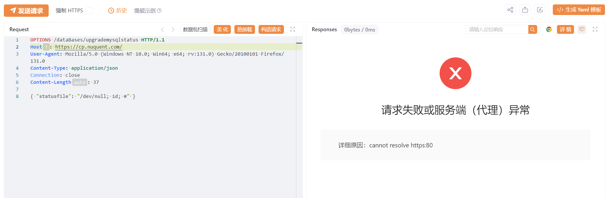
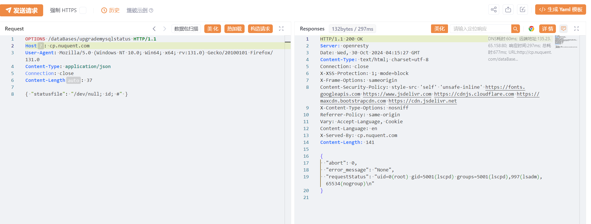

process_urls_tools 简易批量化URL格式处理工具

在批量检测某漏洞的时候可能不少师傅都遇到过这样的情况，从fofa里面导出的资产格式参差不齐，有的有https://  开头有的没有，在使用例如yakit的webfuzz这种对请求包中HOST值设为变量的工具来进行批量检测，主机名中不能包含协议头，然后就报错，挨个手动去掉协议头又很麻烦

使用此脚本可以快速整理大量URL格式

用法：
1.批量将FOFA中原格式的URL导出为txt，每行一个，保存文件名为urls.txt
2.将项目中的process_urls.py与urls.txt放置在同目录下，运行命令python process_urls.py
3.在菜单处选择模式1或者模式2，模式1只保留主机名，不带端口号，如https://192.168.1:80 变为192.168.1。模式2保留主机名和端口号，如https://192.168.1:80 变为192.168.1:80
4.键盘输入1或2后按照对应模式，处理后的url将保存在新生成的processed_urls.txt，每行一个

